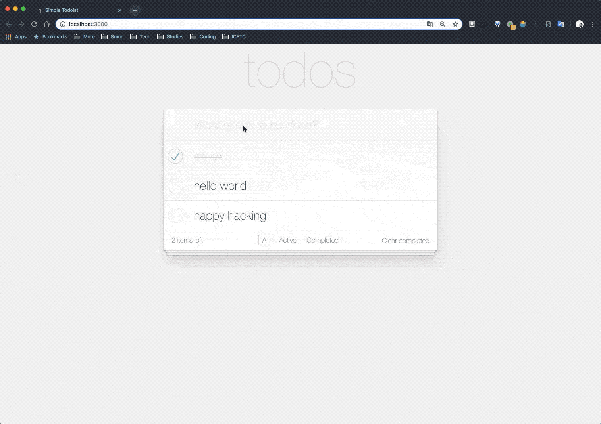

# Todoist
A Simple Todo List Web App

Demo

<div align="center">  </div><br>

框架版本
> django 1.8.19
> 
> djangorestframework 3.6.4
> 
> React 15.5.0

**如何构建**

从 github 下载项目
```bash
$ git clone https://github.com/Zhiwei1996/Todoist.git
$ cd Todoist/
```

安装 python 环境依赖
```bash
$ pipenv --python 2.7 install
$ pipenv shell
```

初始化 Django 配置
```bash
$ cd backend/
$ python manage.py makemigrations todoist
$ python manage.py migrate
```

创建后台管理用户
```bash
$ python manage.py createsuperuser
Username (leave blank to use 'wangzhiwei'): zhiwei
Email address:
Password:
Password (again):
Superuser created successfully.
```

启动 Django RESTful Server
```bash
$ python manager.py runserver
Performing system checks...

System check identified no issues (0 silenced).
December 23, 2018 - 19:42:08
Django version 1.8.19, using settings 'backend.settings'
Starting development server at http://127.0.0.1:8000/
Quit the server with CONTROL-C.
```

构建 React 环境并启动前端服务
```bash
$ cd frontend/
$ yarn
$ yarn start
You can now view todomvc in the browser.

  Local:            http://localhost:3000/
  On Your Network:  http://192.168.151.65:3000/

Note that the development build is not optimized.
To create a production build, use yarn build.
```

**Todoist API Documents**

API
<div align="center">  </div><br>


**TODO:**

- [x] 增加一个待办事项
- [x] 删除一个待办事项
- [x] 标记一个待办事项为已完成
- [x] 编辑一个待办事项的具体内容
- [x] 列出所有的待办事项
- [x] 切换已完成、未完成和所有待办事项列表
- [x] 清除所有已完成事项
- [ ] 列表界面支持翻页
- [ ] 待办事项可以设置优先级 (仅完成 API)
- [ ] 待办事项可以设置 expire date (仅完成 API)
- [ ] 支持按照不同的方式排序，如优先级，expire date